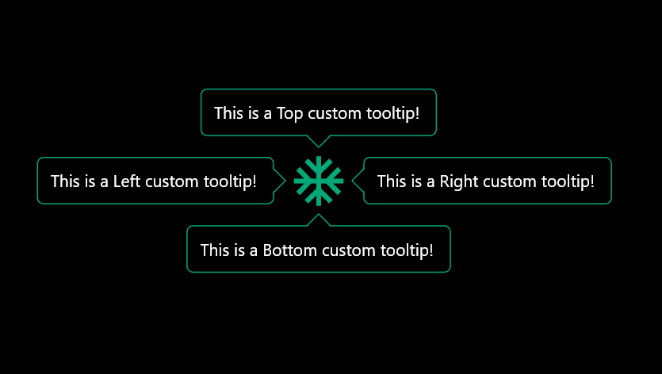

# Smart Tooltip for Flutter

A flexible and customizable tooltip widget for Flutter applications. The `smart_tooltip` package allows you to display tooltips with rich content, custom styling, and dynamic positioning.

## Features

- **Customizable Tooltip Appearance:** Adjust the color, font, size, and shape of the tooltip.
- **Interactive Tooltips:** Support for displaying complex content such as widgets, images, and text within tooltips.
- **Customizable Trigger Events:** Show tooltips on hover, tap, or focus, with easy-to-use event listeners.
- **Positioning Flexibility:** Display tooltips relative to any widget with automatic placement adjustments.

Examples 
## Example 1: Tooltip with Custom Widgets
The advanced tooltip can display custom widgets, allowing you to fully personalize the content inside the tooltip.


## Example 2: Simple Tooltip with Text
The simple tooltip displays text content with a customizable background color, border, and position.



---

## Getting Started

To use the `smart_tooltip` package in your Flutter project:

1. Add the package to your `pubspec.yaml` file:

   ```yaml
   dependencies:
     smart_tooltip: ^0.0.16
2. Run flutter pub get to install the dependencies.

3. Import the package into your Dart file:
    ```yaml
    import 'package:smart_tooltip/smart_tooltip.dart';


4. Usage
    Here’s an example of how to use CustomTooltip:
    ```yaml
    import 'package:flutter/material.dart';
        import 'package:smart_tooltip/smart_tooltip.dart';

        void main() {
        runApp(MyApp());
        }

        class MyApp extends StatelessWidget {
        @override
        Widget build(BuildContext context) {
            return MaterialApp(
            home: Scaffold(
                appBar: AppBar(title: Text('Smart Tooltip Example')),
                body: Center(
                child: SmartTooltip(
                    borderColor: Colors.black,
                    message: 'This is a tooltip!',
                    child: ElevatedButton(
                    onPressed: () {},
                    child: Text('Hover over me'),
                    ),
                ),
                ),
            ),
            );
        }
        }

5.Custom Tooltip with Simple Text:
```yaml
        SmartTooltip(
        borderColor: Colors.black,
        message: 'Here is a custom tooltip!',
        child: Icon(Icons.info),
            ),
5.Custom Tooltip with Custom Widget:
```yaml           
        SmartTooltipWithWidget(
              // border radius of the tooltip soul be equal to the border radius of the content widget widget if any
              borderRadius: 10,
              tooltipContent: Container(
                height: 100,
                width: 100,
                decoration: BoxDecoration(
                  color: Colors.black,
                  borderRadius: BorderRadius.circular(10),
                ),
                child: const Text('Hello'),
              ),
              borderColor: const Color(0xFF04A777),
              position: TooltipPosition.top,
              child: const Icon(
                Icons.ac_unit,
                size: 50,
                color: Color(0xFF04A777),
              ),
            ),


